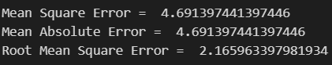

# Implementation-of-Simple-Linear-Regression-Model-for-Predicting-the-Marks-Scored

## AIM:
To write a program to predict the marks scored by a student using the simple linear regression model.

## Equipments Required:
1. Hardware – PCs
2. Anaconda – Python 3.7 Installation / Jupyter notebook

## Algorithm
1. Import the standard Libraries.
2. Set variables for assigning dataset values.
3. Import linear regression from sklearn.
4. Assign the points for representing in the graph. 
5. .Predict the regression for marks by using the representation of the graph. 
6. Compare the graphs and hence we obtained the linear regression for the given datas.
## Program:
### Program to implement the simple linear regression model for predicting the marks scored.
```PYTHON
Developed by: YUVARAJ.S
RegisterNumber: 22008589
# IMPORT REQUIRED PACKAGE
import pandas as pd
import numpy as np
from sklearn.metrics import mean_absolute_error,mean_squared_error
import matplotlib.pyplot as plt
dataset=pd.read_csv('student_scores.csv')
print(dataset)
```
```py
# READ CSV FILES
dataset=pd.read_csv('student_scores.csv')
print(dataset.head())
print(dataset.tail())
```
```py
# COMPARE DATASET
x=dataset.iloc[:,:-1].values
print(x)
y=dataset.iloc[:,1].values
print(y)
```
```py
# PRINT PREDICTED VALUE
from sklearn.model_selection import train_test_split
x_train,x_test,y_train,y_test=train_test_split(x,y,test_size=1/3,random_state=0)
from sklearn.linear_model import LinearRegression
reg=LinearRegression()
reg.fit(x_train,y_train)
y_pred = reg.predict(x_test)
print(y_pred)
print(y_test)
```
```py
# GRAPH PLOT FOR TRAINING SET
plt.scatter(x_train,y_train,color='purple')
plt.plot(x_train,reg.predict(x_train),color='black')
plt.title("Hours vs Scores(Training set)")
plt.xlabel("Hours")
plt.ylabel("Scores")
plt.show()
```
```py
# GRAPH PLOT FOR TESTING SET
plt.scatter(x_test,y_test,color='red')
plt.plot(x_train,reg.predict(x_train),color='black')
plt.title("Hours vs Scores(Testing set)")
plt.xlabel("Hours")
plt.ylabel("Scores")
plt.show()
```
```py
# PRINT THE ERROR
mse=mean_absolute_error(y_test,y_pred)
print('Mean Square Error = ',mse)
mae=mean_absolute_error(y_test,y_pred)
print('Mean Absolute Error = ',mae)
rmse=np.sqrt(mse)
print("Root Mean Square Error = ",rmse)
```

## Output:
### To Read All CSV Files

### To Read Head and Tail Files

### Compare Dataset

### Predicted Value

### Graph For Training Set

### Graph For Testing Set

### Error

## Result:
Thus the program to implement the simple linear regression model for predicting the marks scored is written and verified using python programming.
